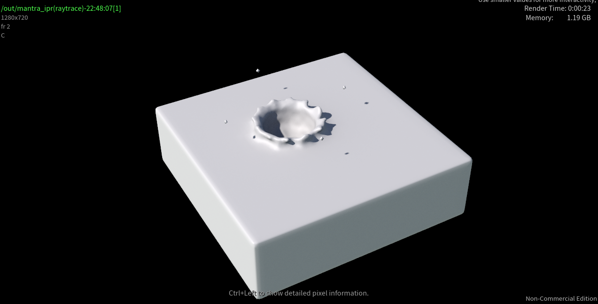
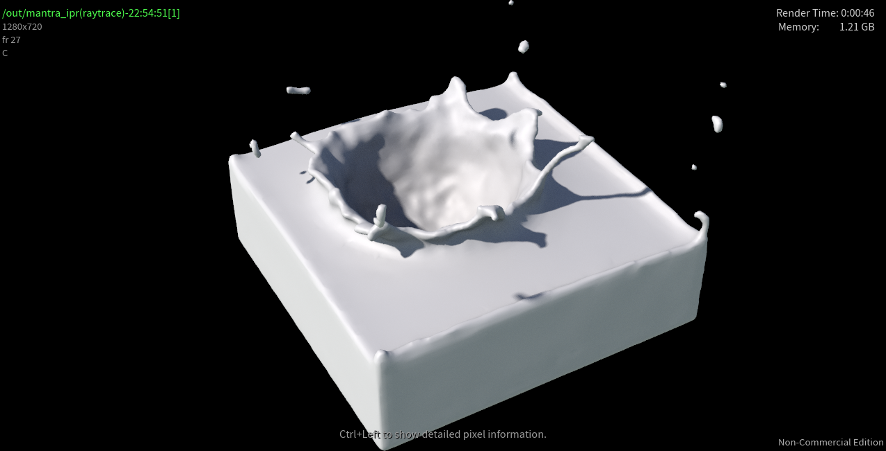
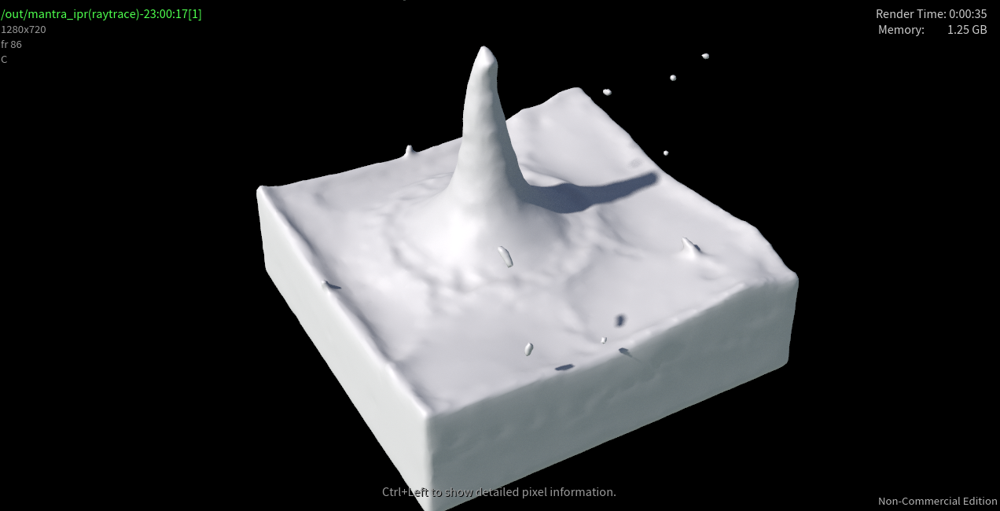

 # Weakly compressible SPH for free surface flows
Implementation of "Weakly compressible SPH for free surface flows" in the Taichi language. `./wcsph.py` is the 2-dimension version and `./wcsph3d.py` is the 3-dimension one.

Furthermore, for improvment, this project implemented the following papers:

(1) Adami S , Hu X Y , Adams N A . A generalized wall boundary condition for smoothed particle hydrodynamics[J]. Journal of Computational Physics, 2012, 231(21):7057-7075.

(2) T. Yang, R. R. Martin, M. C. Lin, J. Chang and S. Hu, "Pairwise Force SPH Model for Real-Time Multi-Interaction Applications," in *IEEE Transactions on Visualization and Computer Graphics*, vol. 23, no. 10, pp. 2235-2247, 1 Oct. 2017, doi: 10.1109/TVCG.2017.2706289.

## Demos

2.5K fluid particles and in real-time simulation (30fps)

2.5K fluid particles with surface tension (Pairwise force)

12.5k particles in offline simulation, export to `.ply`  files and rendered by Houdini.

## Future Improvement
This project is a component of the future implementation of "On the Accurate Large-scale Simulation of Ferrofluids".

